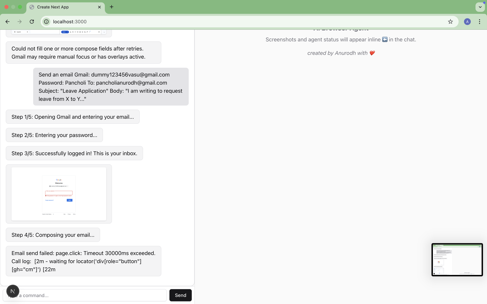
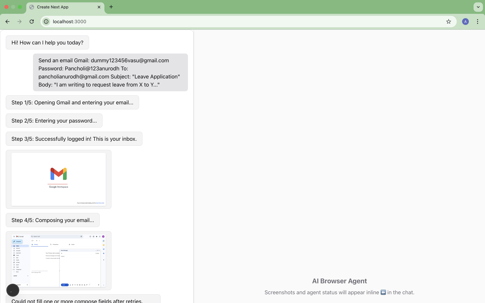

# AI Conversational Browser Automation Agent

## Overview
This project is a prototype of a conversational AI agent that controls a real browser using Next.js, Playwright, and OpenAI. The agent has a ChatGPT-style interface and can interpret user requests, ask clarifying questions, and automate workflows (demonstrated with Gmail email sending). At each browser step, the agent sends a live screenshot inline to the chat, mimicking Proxy Convergence-style UX.

---

## Features
- **Natural conversation**: Type freeform requests (“Send a leave email”). Agent extracts intent, clarifies missing info, and maintains context.
- **Real browser automation**: The backend launches a Chromium browser with Playwright to control Gmail just as a human would—login, compose, send, with screenshots.
- **Stepwise visual feedback**: Each stage (login, compose, etc.) emits a screenshot and a step-bubble into the chat.
- **Security/captcha/2FA awareness**: The agent detects Gmail blocks/captchas/2FA and shows the user the exact screen and a helpful message.
- **Progress UI**: Loading spinner, stepwise message delay, and a modern shadcn chat aesthetic for an engaging experience.
- **Extensible architecture**: Clean separation between NLU, browser logic, and conversational memory; easy to add new browser workflows.

---


##Demo Video URL
[Demo Video ](https://drive.google.com/file/d/1g9o7IuMHalHFA1mlifBuUX-O658iDMuW/view?usp=share_link)


### Gmail Automation Demo





---

## Technology Choices & Rationale
- **Next.js + shadcn/ui**: Modern React app, SSR+API, composable chat/components, quick T3 integration.
- **Playwright**: Best-in-class browser control; robust selectors, screenshots, and headless/visible support.
- **OpenAI GPT-4o**: State-of-the-art NLU for reply/clarification/intent extraction.
- **API/WebSocket**: Clear interface/contract; supports live step streaming.
- **Typescript**: Type safe; error surface/maintenance.

---

## Setup & Running
1. Clone this repo and `cd ai-browser-agent`.
2. Install dependencies:
   ```bash
  
   npm install
   ```
3. **Install browser binaries for Playwright:**
   ```bash
   npx playwright install
   ```
4. Create `.env.local` in the root:
   ```bash
   OPENAI_API_KEY=sk-...yourkey...
   ```
5. Start the development server:
   ```bash
   
   npm run dev
   ```
6. Go to [http://localhost:3000](http://localhost:3000) and try:
   ```
   Send an email
   Gmail: <your_test_account>@gmail.com
   Password: password: <your_password>
   To: <recipient>
   Subject: "Test from AI Agent"
   Body: "This email was sent by an AI agent!"
   ```

**WARNING:** Only use new/dummy Gmail accounts. Some flows will hit captchas/2FA; these are detected and surfaced with screenshots. No credentials are stored.

---

## Demo Video Suggestion
- Record a Chrome screencast as:
  1. Type a conversational email request.
  2. Agent asks for missing info (show stepwise clarification).
  3. Provide full details (account/password/test etc.).
  4. Watch as stepwise progress messages and screenshots appear.
  5. If captcha/security screen is hit, show how the agent detects/explains it.
- Target: 2-3 mins focused walkthrough.

---

## Typical Workflow/UX
- User types native language request.
- Agent: “I need your Gmail, password (test), To, Subject, Body.”
- User provides info
- Agent: “Step 1/5: Opening Gmail...” (shows screenshot)
- “Step 2/5: Entering password...” (screenshot)
- “Blocked by Captcha/2FA” (user sees actual block)
- On success: Shows Compose, draft, send, and final inbox visible—all with screenshots.

---

## Handling of Google Challenges
- If any of the following detected after an action:
  - Captcha/Recaptcha iframe
  - “Enter the characters you see” text
  - Phone/code/2FA input
  - “Review your phone” or “Verify it’s you” screens
- Agent posts a screenshot and message like:
  > Blocked by Captcha or security check. Please review your Gmail account...
- If **inbox never loads or password input is missing**: user is shown the real error state, so all blocks are transparent.

---

## Security & Limitations
- **Never use your real email/password**: this is for new/dummy Gmail only.
- No credentials are logged/stored. All email fields are kept in ephemeral memory for the session.
- Browser blocks and Gmail security checks are common and expected.
- Playwright automation cannot solve Google captchas/2FA—will always need manual override.

---

## Extending Further
- Add more browser flows by building new Playwright steps and intent modules
- Switch to WebSockets for push-style updates
- Add richer context memory/multi-session handling
- Change UI branding/themes in `tailwind.config.ts`

---

## Challenge Reflection
- **Key challenges**: Browser provider security, natural intent parsing for open-ended chat, and live feedback UI.
- **Solution**: Stepwise plan extraction and blended AI/bot/real browser flow, with “see what the agent sees” UX.

---

## License
created by Anurodh Pancholi


